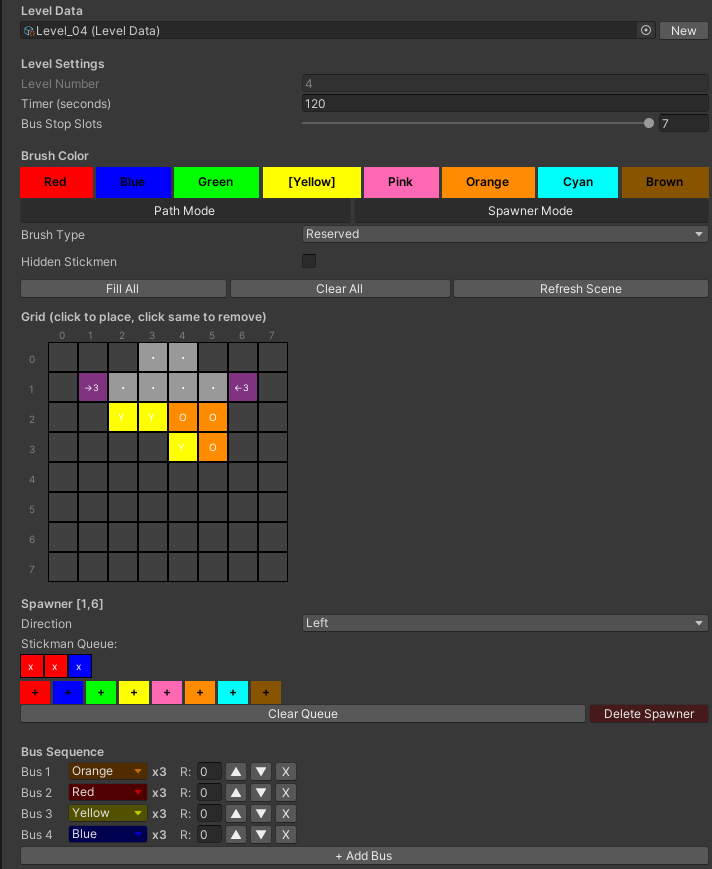
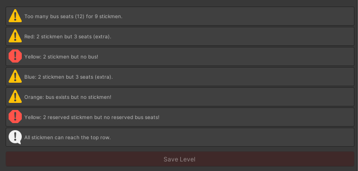
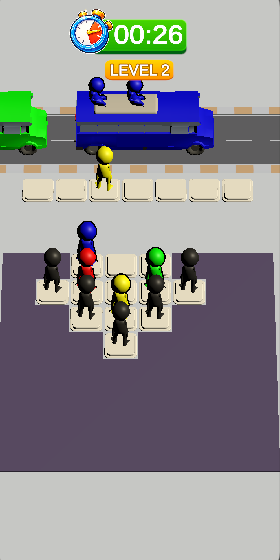
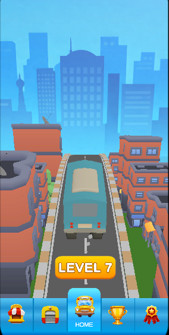

# Bus Jam - Case Study

A Bus Jam clone built in Unity 2022.3.19f1 for Rollic's Game Developer case study.

## How to Play

1. Open `MenuScreen` scene and press Play
2. Tap the Level button to start gameplay
3. Tap stickmen to move them to the bus stop
4. Stickmen board buses that match their color
5. Clear all stickmen to complete the level

## Architecture

### Screens
- **MenuScreen** - Home screen with level indicator, tap to play
- **GameplayScreen** - Core puzzle gameplay with timer
- **Win/Lose Panels** - Level complete or fail UI with continue/retry

### Game Flow
```
MenuScreen → GameplayScreen → Win → MenuScreen (next level)
                             → Lose → Restart same level
```
### Level Data
Levels are ScriptableObjects stored in `Resources/LevelData/`. Each level contains:
- Grid cell placements (stickmen positions and colors)
- Active path cells (walkable areas)
- Spawner placements (auto-spawn stickmen when adjacent cell is empty)
- Bus sequence (color and order)
- Bus stop slot count (3-7)
- Timer duration
- Hidden stickman support
- Reserved stickman/bus support

### Save System
`PlayerData` uses PlayerPrefs to persist current level progress. Players resume from their last completed level on app restart.

## Level Editor

### How to Open
1. Open `Scenes/EditorScene` in Unity
2. Select the **LevelEditor** GameObject in the Hierarchy
3. The custom inspector appears in the Inspector panel



### Features
- **Grid Editor** - Click cells to place/remove stickmen with selected color
- **Brush Type** - Normal or Reserved stickmen
- **Hidden Mode** - Toggle to make all stickmen hidden (revealed during gameplay when path opens)
- **Path Mode** - Toggle walkable cells on/off
- **Spawner Mode** - Place spawner objects with direction and color queue
- **Bus Sequence** - Add/remove/reorder buses with color selection and reserved seats
- **Bus Stop Slots** - Configurable 3-7 slots
- **Validation** - Real-time checks for stickman/bus count matching, path connectivity, spawner targets
- **Scene Preview** - All changes reflect in the scene view immediately
- **Play Test** - "Play This Level" button to test directly from editor

### Creating a Level
1. Click "New" to create a new level
2. Use color buttons to select stickman color
3. Click grid cells to place stickmen
4. Use Path Mode to create walkable areas
5. Add buses matching the stickman colors (each bus holds 3)
6. Set timer duration
7. Save when validation passes (green Save button)

## Game Mechanics

### Stickman Movement
- Stickmen with a clear path to the top row show an outline (clickable)
- Tapped stickmen move via BFS shortest path to the top row
- From the top row, they move to an available bus stop slot
- Multiple stickmen can move simultaneously

### Bus System
- All buses spawn at game start in a line
- Matching colored stickmen board the front bus
- When a bus is full (3 passengers), it drives away
- Remaining buses shift forward
- Reserved seats require reserved stickmen

### Win/Lose Conditions
- **Win** - All stickmen cleared from grid, bus stop empty, all spawners exhausted
- **Lose** - Timer runs out, or bus stop is full with no possible moves

### Special Features
- **Hidden Stickmen** - Appear black until their path to top row opens
- **Reserved System** - Reserved stickmen can only board reserved bus seats
- **Spawners** - Objects that auto-spawn stickmen when the adjacent cell is empty

## Screenshots

| Level Editor | Validation |
|---|---|
|  |  |

| Gameplay | Menu |
|---|---|
|  |  |
